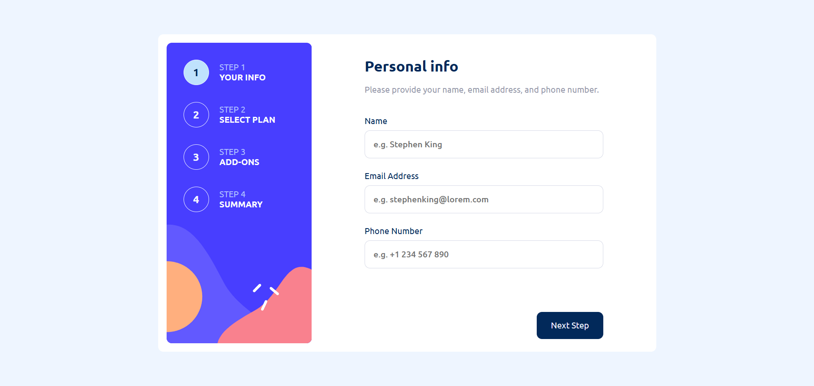

# 📝 Multi-Step Form (Frontend Mentor)

Este projeto foi desenvolvido como parte do desafio [Multi-step form](https://www.frontendmentor.io/solutions/multi-step-form-using-react-hook-form-OYa4qkQunZ) da [Frontend Mentor](https://www.frontendmentor.io/challenges/multistep-form-YVAnSdqQBJ). Consiste em um formulário multi-etapas dividido em quatro passos, simulando um fluxo de cadastro real utilizado em aplicações modernas. 

Cada etapa coleta diferentes tipos de informações, garantindo uma experiência fluida e organizada para o usuário. Para o gerenciamento dos inputs e validações, foi utilizado o React Hook Form, o que garante maior performance e flexibilidade na manipulação dos dados. O layout é adaptável a diferentes tamanhos de tela, proporcionando uma navegação intuitiva desde dispositivos móveis até desktops.

## 👀 Preview

## ▶️ Demo

Clique <a href="https://multi-step-form-fem-nine.vercel.app/" target="_blank" rel="noopener noreferrer">aqui</a>  para acessar o projeto online

## ⚙️ Funcionalidades

- ✅ **Validação de campos obrigatórios** (nome, e-mail e telefone) com React Hook Form
- 📦 **Seleção de plano** entre três opções com alternância entre assinatura mensal e anual
- ➕ **Possibilidade de adicionar complementos** (add-ons), com valores dinâmicos conforme a escolha anterior
- 🧾 **Tela de resumo** com todas as informações escolhidas e valor total da assinatura
- 📱 **Layout 100% responsivo** adaptado para diferentes tamanhos de tela

## 💻 Tecnologias usadas

## 👨‍💻 Autor

<a href="https://portfolio-pessoal-alpha-nine.vercel.app/" target="_blank" rel="noopener noreferrer">Erik Alves</a>

